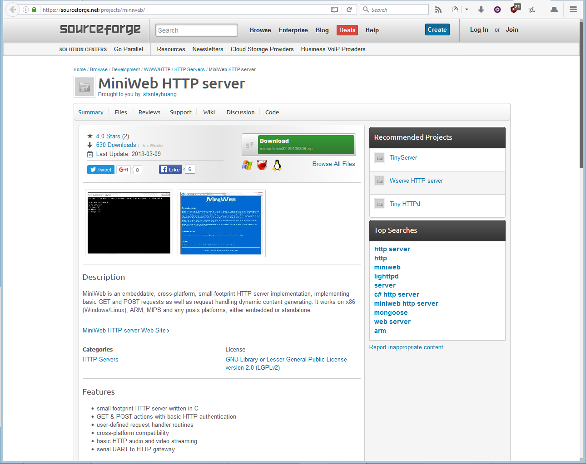

This is a fork of http://miniweb.sourceforge.net/ (up to rev. 208), with enhanced directory listing

This repository has an LGPLv2 license.

The original project page states that the license is LGPLv2, but there are no
license files at the repo. Also, the default page at bin/htdocs says "MiniWeb -
The open-source mini HTTP server - Small and elegent".

If the original author feels this is an incorrect interpretation of the license,
please contact me (avih) and I'll update the license accordingly.

Here's a screenshot of the original project page, taken on 2016-06-23, which
includes the license:

